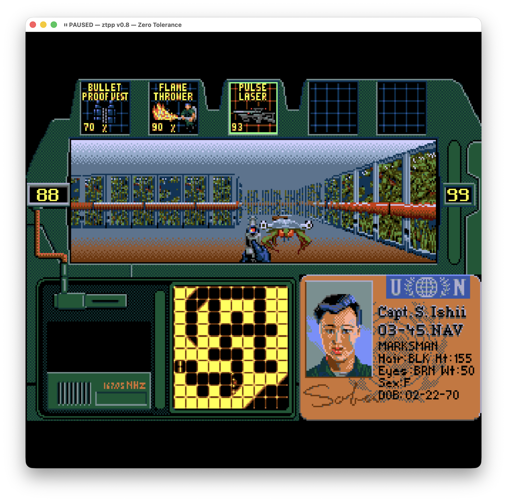

# ztpp — Zero Tolerance port (C++ / SDL2)

A from-scratch reimplementation of **Zero Tolerance** (Sega Mega Drive / Genesis, 1994) in
C++/SDL2 — a first-person engine rebuilt from behaviour, not a decompilation. Work in progress.



*Reference mode — the original ZT cockpit HUD with the first-person view, radar and inventory (macOS build).*

> Created with heavy use of **Claude (Anthropic's AI)** — the reverse-engineering,
> analysis, and most of the implementation were done together with it.

> ⚠ The original **Zero Tolerance** ROM (US/EU release, Rev A) is fully supported.
> **Zero Tolerance Underground** is playable with **partial support**. The German build and
> Beyond Zero Tolerance prototypes are planned — see [Planned](#planned).

> Development is intentionally **very slow-paced** — this is a hobby project.

> ⚠ Developed and tested **only on macOS**. Linux/Windows should work (portable CMake + SDL2) but are
> untested — patches welcome.

## Goal
Build a port that is as **accurate to the original as possible** — reference-faithful to the Mega Drive
game — plus modern **quality-of-life** features that don't change the game itself (rebindable controls,
gamepad, save games, resolution / full-screen options, …). The game is playable start to finish —
a **demo release (v0.8)** is being prepared.

## What works
- Rendering as close to the original as possible, reconstructed from the reverse-engineered draw
  algorithm (reference cockpit HUD, per-column CLUT shading, sprite scaling, panorama backgrounds)
- Original player physics (ZT inertia, integer Mega-Drive movement path, knockback/stun, stances)
- All 10 enemy types with byte-audited AI: attack cycles, telegraphs, walk-by-distance animation,
  death sequences, stealth/darkness rolls, pack alerts — no artificial i-frames, ROM damage model
- Bosses and the full episode-completion flow (briefings, MISSION CODE, gear carries over,
  victory returns to the intro)
- All weapons and items: cone auto-aim, distance damage curves, 5-slot inventory carousel,
  consumable drain, vest, corpse looting
- Stairs, elevators, doors, destructible & secret walls, explosions and chain detonations
- The background sniper on the rooftops (building overlay, ricochets, rocket tracer kill)
- "Sky walls": station windows and roof parapets swallow shots, the laser sight aims through them
- Character selection (perks, DECEASED cards), boot intro (SEGA / Accolade / Technopop / title),
  cutscenes, pause map (TAB)
- Sound through a **YM2612 / YM3438** chip emulator: GEMS music (FM/PSG/DAC), PCM voice samples,
  per-event SFX
- Save/load (6 slots + quick), rebindable controls (4 presets), GZDoom-style console
- Mouse control with adjustable sensitivity and smooth camera turning (frame-interpolated view
  on top of the bit-exact 15 Hz simulation)
- Optional unlimited inventory (the original 5-slot carousel stays the default)
- ROM launcher (native on macOS, SDL fallback everywhere; Win32/GTK best-effort)
- **Zero Tolerance Underground** — playable, partial support

## Not done yet
- Gamepad support
- The password system (ROM-compatible encode/decode and entry screen exist, but open questions remain)
- A fully fixed-point render path (the math is float today, verified against MAME within 0.1%)
- There are still some discrepancies with the original here and there — behaviour keeps being
  verified against the disassembly and MAME and fixed as they are found
- Minor polish: elevator blue-void edge cases, exact flashlight ramp, small HUD discrepancies

## Planned
- Full support for the **German build** and **Beyond Zero Tolerance** (June & July prototypes);
  finishing **Zero Tolerance Underground**
- Gamepad support with rumble
- A "what if the game had shipped on Sega CD / 32X" mode — a purely visual what-if on the more capable
  hardware; gameplay and mechanics stay identical to the original.

## Requirements
- A C++17 compiler and **CMake ≥ 3.16**
- **SDL2**:
  - macOS: `brew install sdl2`
  - Linux (Debian/Ubuntu): `sudo apt install libsdl2-dev`
  - Windows: vcpkg (`vcpkg install sdl2`) or MSYS2 (`pacman -S mingw-w64-x86_64-SDL2`)
- **Nuked-OPN2** chip core — **not bundled**. Download `ym3438.c` and `ym3438.h` from
  <https://github.com/nukeykt/Nuked-OPN2> into [`src/opn2/`](src/opn2/) (see the note there).
- **Your own copy of the ROM.** It is **not** included — you supply the file yourself. No game data
  ships in this repo.

## Build
> ⚠ Built and tested **only on macOS** (Apple Silicon & Intel). Linux/Windows should work (portable
> CMake + SDL2) but are **untested** — the steps below are the verified macOS path.

1. **Install SDL2** — `brew install sdl2` (Linux/Windows: see [Requirements](#requirements)).
2. **Add the Nuked-OPN2 chip core** (LGPL-2.1, *not* bundled): download `ym3438.c` and `ym3438.h`
   from <https://github.com/nukeykt/Nuked-OPN2> into [`src/opn2/`](src/opn2/).
3. **Configure & build:**
   ```bash
   cmake -B build
   cmake --build build --parallel
   ```
   On macOS you can instead just run `./build.sh` — it does both steps.

The project is built as **several translation units** (`src/`, `src/rom/`, `src/render/`) rather than one
unity file, so incremental rebuilds are quick and `--parallel` speeds up a clean build. Sources are globbed
with `CONFIGURE_DEPENDS`, so adding or removing a `.cpp` is picked up on the next build without re-running
`cmake` by hand.

The resulting binary is `build/ztpp` (see [Run](#run) below).
On Windows pass your toolchain, e.g. `cmake -B build -DCMAKE_TOOLCHAIN_FILE=<vcpkg>/scripts/buildsystems/vcpkg.cmake`.

### Docker (optional)
A `Dockerfile` builds it reproducibly (Linux container, fetches Nuked-OPN2 for you):
```bash
docker build -t ztpp .
docker run --rm -v "$PWD/roms:/roms" -v "$PWD/out:/out" ztpp "/roms/your.gen" --dump /out/frame.ppm
```
(The interactive window needs OS-specific X11/Wayland forwarding; headless `--dump` works as-is.)

## Run
```bash
./build/ztpp "path/to/Zero Tolerance (ROM).gen"
```
Headless render of one frame (no window): `./build/ztpp <rom> --dump out.ppm`.
Controls and the in-game console are documented in [`CONSOLE.md`](CONSOLE.md).

## License
- Port source code: **LGPL-2.1** — © **Willy Wodka**.
- `src/opn2/ym3438.*` (Nuked-OPN2): **LGPL-2.1**, fetched separately, © Alexey Khokholov.
- *Zero Tolerance* and all its data/assets are © their respective rights holders and are **not** part
  of this repository.

## Related repositories
- **ztextractor** — data inspection/extraction tool for the ROM: <https://github.com/wowwillywodka/ztextractor>

## Acknowledgements
- **Smoke** — the **BZTEdit** editor; the map-cell icons used in the port come from it.
- **alex-west** — **zmap-tools** (ZMAP level format and ZT texture-bank references).
- **Firewing** & **Lurler** — **ZTEdit** / its modified version (ZMAP format).
- **Dr MeFiSto** (<https://github.com/lab313ru>) — the Ghidra plugin for reverse-engineering Mega Drive games.
- **realmonster** — GEMS tools (<https://github.com/realmonster/GEMS>); the port's understanding of GEMS sound is based on them.
- **ValleyBell** — GEMSPlay (GEMS PCM sample-bank format).
- **Nuked-OPN2** by **nukeykt** — the YM2612 / YM3438 emulator used for sound playback.
- **Claude (Anthropic)** — reverse-engineering, analysis, and most of the implementation.

---
---

# ztpp — порт Zero Tolerance (C++ / SDL2)

Реимплементация игры **Zero Tolerance** (Sega Mega Drive / Genesis, 1994) на C++/SDL2 с нуля —
движок от первого лица, воссозданный по поведению (это **не** декомпиляция). В разработке.


*Reference-режим — оригинальный кокпит-HUD ZT: вид от первого лица, радар и инвентарь (сборка на macOS).*

> Сделано при активном участии **Claude (ИИ от Anthropic)** — реверс-инжиниринг,
> анализ и бо́льшая часть реализации выполнены вместе с ним.

> ⚠ Оригинальный ROM **Zero Tolerance** (релиз US/EU, Rev A) поддерживается полностью.
> **Zero Tolerance Underground** играбелен с **частичной поддержкой**. Немецкий билд и прототипы
> Beyond Zero Tolerance — в планах (см. [Планируется](#планируется)).

> Разработка сознательно ведётся **очень неспешно** — это хобби-проект.

> ⚠ Разрабатывалось и тестировалось **только на macOS**. Linux/Windows должны работать (портативные
> CMake + SDL2), но не проверялись — патчи приветствуются.

## Цель
Сделать максимально **точный порт оригинала** — референс-достоверность к игре на Mega Drive — плюс современные
**quality-of-life** фичи, которые не меняют саму игру (переназначаемое управление, геймпад, сохранения, настройки
разрешения / полноэкранного режима, …). Игра проходится от начала до конца — готовится **демо-релиз (v0.8)**.

## Что готово
- Максимально близкий к оригиналу рендер по реверсу оригинального алгоритма отрисовки
  (reference-кокпит HUD, поколоночный CLUT-шейдинг, масштабирование спрайтов, фоны-панорамы)
- Оригинальная физика игрока (ZT-инерция, целочисленный MD-путь движения, нокбэк/стан, стойки)
- Все 10 типов врагов с побайтно выверенным ИИ: боевые циклы, телеграфы атак, анимация ходьбы
  по пройденному пути, последовательности смерти, стелс/тьма, пак-алерты — без искусственных
  i-frames, модель урона как в ROM
- Боссы и полный флоу завершения эпизодов (брифинги, MISSION CODE, перенос снаряжения,
  после победы — возврат на заставку)
- Всё оружие и предметы: конус-автонаведение, дистанционные кривые урона, карусель-инвентарь
  на 5 слотов, расход пассивок, жилет, лут с трупов
- Лестницы, лифты, двери, разрушаемые и секретные стены, взрывы и цепные детонации
- Фоновый снайпер на крышах (здание на панораме, рикошеты, убийство ракетой-трассером)
- «Небесные стены»: окна станции и парапеты крыши глотают выстрелы, лазерный прицел
  смотрит сквозь них
- Выбор бойца (перки, карточки DECEASED), boot-интро (SEGA / Accolade / Technopop / титул),
  заставки, пауза-карта (TAB)
- Звук через эмулятор чипа **YM2612 / YM3438**: музыка GEMS (FM/PSG/DAC), PCM-озвучка,
  событийные SFX
- Сейвы (6 слотов + quick), переназначаемое управление (4 пресета), консоль в стиле GZDoom
- Управление мышью с настраиваемой чувствительностью и механизм плавного поворота камеры
  (интерполяция кадров поверх бит-точной симуляции 15 Гц)
- Возможность сделать инвентарь безграничным (по умолчанию — оригинальная карусель на 5 слотов)
- Лаунчер выбора ROM (нативный на macOS, SDL-фолбэк везде; Win32/GTK best-effort)
- **Zero Tolerance Underground** — играбелен, частичная поддержка

## Что не сделано
- Поддержка геймпада
- Система паролей (ROM-совместимые кодирование/декодирование и экран ввода есть, но остаются
  открытые вопросы)
- Полностью целочисленный (fixed-point) рендер-путь (математика пока float, сверена с MAME
  в пределах 0.1%)
- Местами ещё встречаются расхождения с оригиналом — поведение продолжает сверяться
  с дизассемблированием и MAME, найденное исправляется
- Мелкая полировка: краевые случаи синего фона лифта, точная рампа фонаря, мелкие расхождения HUD

## Планируется
- Полная поддержка **немецкого билда** и **Beyond Zero Tolerance** (июньский и июльский прототипы);
  доведение **Zero Tolerance Underground**
- Поддержка геймпадов и вибрации
- Режим «что, если бы игра вышла на Sega CD / 32X» — чисто визуальный what-if на более мощном железе;
  геймплей и механики — как в оригинале, без изменений.

## Требования
- Компилятор C++17 и **CMake ≥ 3.16**
- **SDL2**:
  - macOS: `brew install sdl2`
  - Linux (Debian/Ubuntu): `sudo apt install libsdl2-dev`
  - Windows: vcpkg (`vcpkg install sdl2`) или MSYS2 (`pacman -S mingw-w64-x86_64-SDL2`)
- Ядро чипа **Nuked-OPN2** — **в репозиторий не входит**. Скачай `ym3438.c` и `ym3438.h` с
  <https://github.com/nukeykt/Nuked-OPN2> в [`src/opn2/`](src/opn2/) (см. заметку там).
- **Свой ROM.** В репозитории его **нет** — файл предоставляешь сам. Никаких игровых данных в
  репозитории нет.

## Сборка
> ⚠ Собиралось и тестировалось **только на macOS** (Apple Silicon и Intel). Linux/Windows должны
> работать (портативные CMake + SDL2), но **не проверялись** — шаги ниже это выверенный путь для macOS.

1. **Установи SDL2** — `brew install sdl2` (Linux/Windows — см. [Требования](#требования)).
2. **Добавь ядро чипа Nuked-OPN2** (LGPL-2.1, в репозиторий *не* входит): скачай `ym3438.c` и `ym3438.h`
   с <https://github.com/nukeykt/Nuked-OPN2> в [`src/opn2/`](src/opn2/).
3. **Конфигурация и сборка:**
   ```bash
   cmake -B build
   cmake --build build --parallel
   ```
   На macOS можно вместо этого просто запустить `./build.sh` — он делает оба шага.

Проект собирается из **нескольких единиц трансляции** (`src/`, `src/rom/`, `src/render/`), а не одним
unity-файлом, — поэтому инкрементальная пересборка быстрая, а `--parallel` ускоряет чистую сборку.
Исходники подхватываются через `CONFIGURE_DEPENDS`, так что добавление/удаление `.cpp` подхватится при
следующей сборке без ручного перезапуска `cmake`.

Готовый бинарник — `build/ztpp` (см. [Запуск](#запуск) ниже).
На Windows укажи тулчейн, напр. `cmake -B build -DCMAKE_TOOLCHAIN_FILE=<vcpkg>/scripts/buildsystems/vcpkg.cmake`.

### Docker (опционально)
`Dockerfile` собирает воспроизводимо (Linux-контейнер, сам качает Nuked-OPN2):
```bash
docker build -t ztpp .
docker run --rm -v "$PWD/roms:/roms" -v "$PWD/out:/out" ztpp "/roms/your.gen" --dump /out/frame.ppm
```
(Интерактивное окно требует проброса X11/Wayland под конкретную ОС; безоконный `--dump` работает сразу.)

## Запуск
```bash
./build/ztpp "путь/к/Zero Tolerance (ROM).gen"
```
Безоконный рендер одного кадра: `./build/ztpp <rom> --dump out.ppm`.
Управление и встроенная консоль — в [`CONSOLE.md`](CONSOLE.md).

## Лицензия
- Код порта: **LGPL-2.1** — © **Willy Wodka**.
- `src/opn2/ym3438.*` (Nuked-OPN2): **LGPL-2.1**, качается отдельно, © Alexey Khokholov.
- *Zero Tolerance* и все её данные/ассеты © правообладателям и **не** входят в этот репозиторий.

## Связанные репозитории
- **ztextractor** — инструмент инспекции/извлечения данных из ROM: <https://github.com/wowwillywodka/ztextractor>

## Благодарности
- **Smoke** — редактор **BZTEdit**; иконки клеток карты в порте взяты из него.
- **alex-west** — **zmap-tools** (формат уровней ZMAP и банки текстур ZT).
- **Firewing** и **Lurler** — **ZTEdit** / его модифицированная версия (формат ZMAP).
- **Dr MeFiSto** (<https://github.com/lab313ru>) — плагин для Ghidra под реверс игр Mega Drive.
- **realmonster** — инструменты GEMS (<https://github.com/realmonster/GEMS>); понимание звука GEMS в порте сделано на их основе.
- **ValleyBell** — GEMSPlay (формат банка PCM-сэмплов GEMS).
- **Nuked-OPN2** от **nukeykt** — эмулятор YM2612 / YM3438 для воспроизведения звука.
- **Claude (Anthropic)** — реверс-инжиниринг, анализ и бо́льшая часть реализации.
